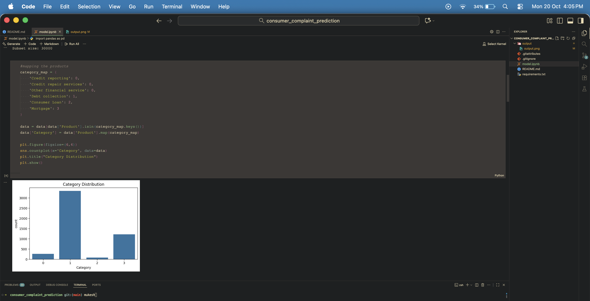

# Consumer Complaints Classification Project

A brief description of your project goes here.

---

## Table of Contents

- [Environment Setup](#environment-setup)
- [Dependencies](#dependencies)
- [Data Categories](#data-categories)
- [Git LFS Setup](#git-lfs-setup)
- [Usage](#usage)

---

## Environment Setup

To create and activate a Python virtual environment for this project:

```bash
# Create a virtual environment and register it with Jupyter
python -m ipykernel install --user --name=myenv --display-name "Python (myenv)"
````

Activate your environment:

```bash
# Windows
myenv\Scripts\activate
```

```bash
# macOS / Linux
source myenv/bin/activate
```

---

## Dependencies

All required Python packages are listed in `requirements.txt`. Install them with:

```bash
pip install -r requirements.txt
```

To generate `requirements.txt` after installing packages:

```bash
pip freeze > requirements.txt
```

---

## Data Source

The dataset is downloaded using the `requests` package from:

```bash
https://files.consumerfinance.gov/ccdb/complaints.csv.zip
```

---

## Data Preprocessing

1. Unnecessary columns and results are dropped.
2. A sample of 20,000 rows is taken to ensure smooth processing on laptops with 8–16 GB RAM.
3. Text cleaning is performed: removing punctuations, converting to lowercase, etc.
4. Vectorization of text data for machine learning.

---

## Handling Class Imbalance

* SMOTE (Synthetic Minority Over-sampling Technique) is used to equalize all category sizes.

---

## Model Training & Evaluation

* Models tested:

  * Logistic Regression
  * Naive Bayes
  * Random Forest
  * Decision Tree

* **Best model:** Logistic Regression

* **Accuracy:** 0.9335

**Classification Report:**

```text
              precision    recall  f1-score   support

           0       0.80      0.60      0.69        53
           1       0.95      0.97      0.96       666
           2       0.78      0.44      0.56        16
           3       0.93      0.93      0.93       242

    accuracy                           0.93       977
   macro avg       0.86      0.74      0.78       977
weighted avg       0.93      0.93      0.93       977
```

---

## Git LFS Setup

```bash
# Install Git LFS
git lfs install

# Track all CSV files
git lfs track "*.csv"

# Add changes and commit
git add .
git commit -m "Cleaned notebook and tracked large files with LFS"

# Push to remote repository
git push -u origin main
```


